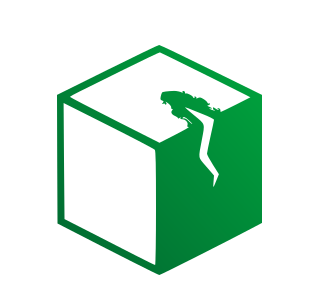

<p align="center">
  
</p>

# unhealthy

`unhealthy` is a small Go-based Docker monitor that watches for containers whose health status becomes `unhealthy` and sends a configurable HTTP request when that happens.

## How it works

1. The process connects to the local Docker daemon.
2. It polls for containers with an `unhealthy` health check state.
3. For each newly unhealthy container, it renders the configured URL and request body templates.
4. It sends the HTTP request once per unhealthy period and waits until the container recovers before sending another notification for the same container.

The published container image is built as a minimal `scratch` image and only contains the statically linked Go binary plus CA certificates for outbound HTTPS requests.

## Configuration

All configuration is provided through environment variables.

| Variable | Required | Default | Description |
| --- | --- | --- | --- |
| `REQUEST_URL` | Yes | - | Target URL for the outgoing request. Template variables are supported. |
| `REQUEST_BODY_TEMPLATE` | Yes | - | Request body template. Template variables are replaced before the request is sent. |
| `REQUEST_METHOD` | No | `POST` | HTTP method for the outgoing request. |
| `REQUEST_TIMEOUT` | No | `10s` | Timeout for the outgoing request. |
| `POLL_INTERVAL` | No | `30s` | How often Docker should be checked for unhealthy containers. |
| `REQUEST_HEADERS_JSON` | No | `{"Content-Type":"application/json"}` | JSON object of headers to attach to the request. |
| `REQUEST_CONTENT_TYPE` | No | `application/json` | Convenience override for the `Content-Type` header. |
| `DOCKER_HOST` | No | Docker default | Optional Docker endpoint override supported by the Docker client. |

## Template variables

Templates use placeholders like `{{ container.name }}` and `{{ time.rfc3339 }}`.

Available variables:

| Variable | Description |
| --- | --- |
| `{{ container.id }}` | Container ID |
| `{{ container.name }}` | Container name without the leading slash |
| `{{ container.image }}` | Image name |
| `{{ container.status }}` | Health status when available, otherwise Docker state |
| `{{ container.state }}` | Docker container state |
| `{{ container.health }}` | Docker health status |
| `{{ container.started_at }}` | Container start timestamp from Docker |
| `{{ time.rfc3339 }}` | Current UTC timestamp in RFC3339 format |
| `{{ time.unix }}` | Current UTC Unix timestamp |

Example body template:

```json
{ "message": "The container {{ container.name }} has the status {{ container.status }}", "number": "+1234567", "recipients": ["YOURSELF"] }
```

## Example compose file

An example `compose.yml` is included in the repository:

```yaml
services:
  unhealthy-monitor:
    image: ghcr.io/weber-man/unhealthy:latest
    pull_policy: always
    restart: unless-stopped
    environment:
      POLL_INTERVAL: 30s
      REQUEST_URL: https://example.invalid/webhook
      REQUEST_METHOD: POST
      REQUEST_TIMEOUT: 10s
      REQUEST_BODY_TEMPLATE: >-
        { "message": "The container {{ container.name }} has the status {{ container.status }}",
        "number": "+123456789",
        "recipients": ["yourself"] }
    volumes:
      - /var/run/docker.sock:/var/run/docker.sock:ro
```

The Docker socket mount is required so the monitor can inspect local containers.

## Run locally

```bash
go test ./...
REQUEST_URL=https://example.invalid/webhook \
REQUEST_BODY_TEMPLATE='{"message":"The container {{ container.name }} has the status {{ container.status }}"}' \
go run .
```

## Build with GitHub Actions

The repository includes `.github/workflows/build.yml`, which:

- runs `go test ./...`
- builds and publishes `ghcr.io/weber-man/unhealthy` only when a version tag like `v1.2.3` is pushed
- publishes the image with both the release tag, for example `ghcr.io/weber-man/unhealthy:v1.2.3`, and `ghcr.io/weber-man/unhealthy:latest`
- runs `go test ./...` for pull requests without publishing a container image
- publishes multi-architecture images for `linux/amd64` and `linux/arm64`

If the package is not publicly pullable after the first publish, set the package visibility to public in the GitHub package settings for the repository.

Example release flow:

```bash
git tag v1.2.3
git push origin v1.2.3
```

## Docker image

Pull the published image:

```bash
docker pull ghcr.io/weber-man/unhealthy:latest
```

Run locally:

```bash
docker run --rm \
  -e REQUEST_URL=https://example.invalid/webhook \
  -e REQUEST_BODY_TEMPLATE='{"message":"The container {{ container.name }} has the status {{ container.status }}"}' \
  -v /var/run/docker.sock:/var/run/docker.sock:ro \
  ghcr.io/weber-man/unhealthy:latest
```
